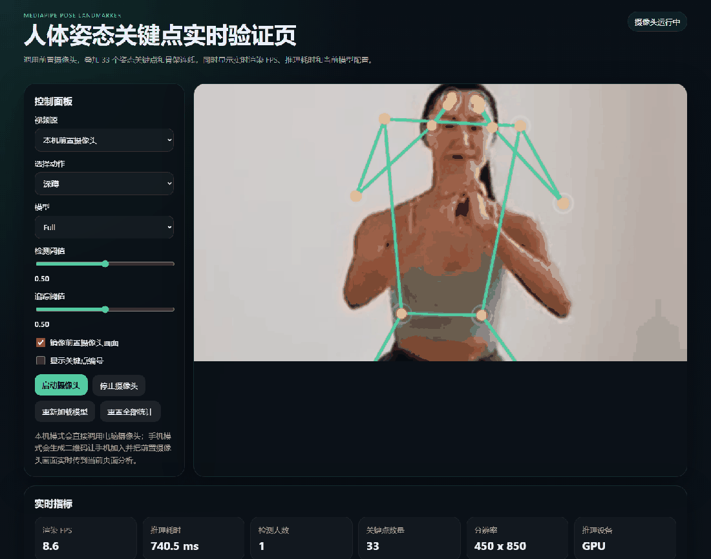
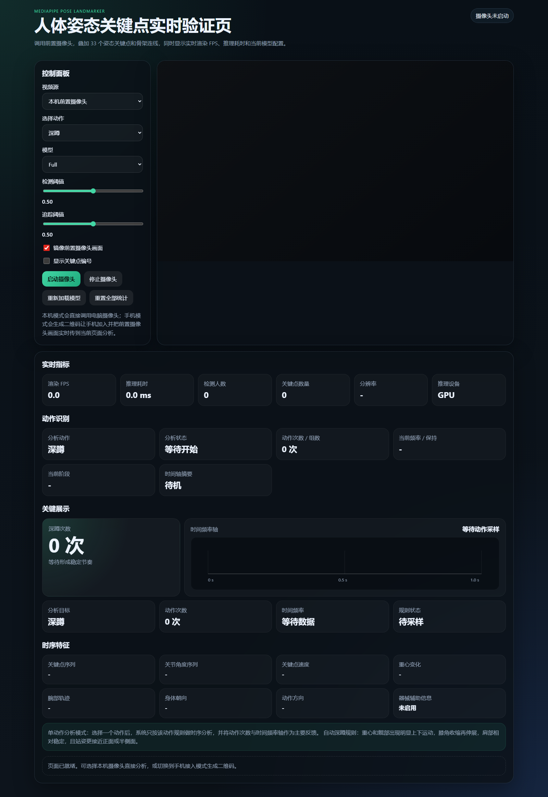
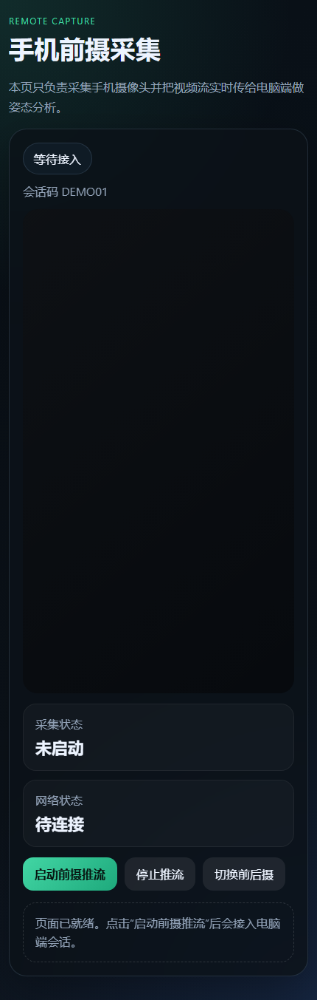
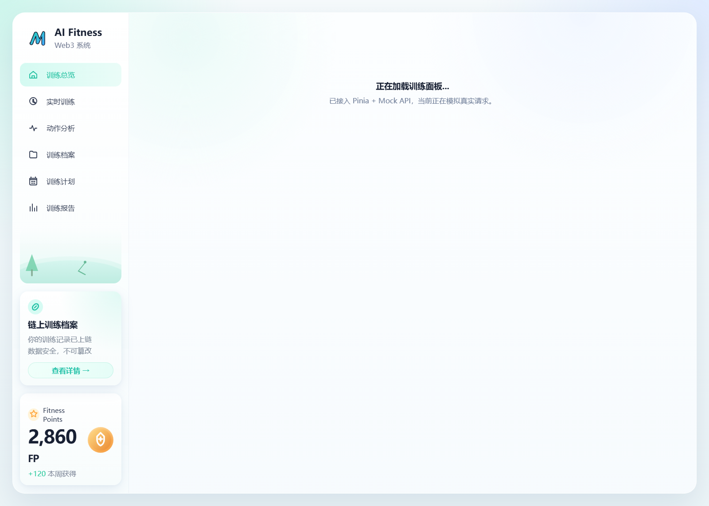
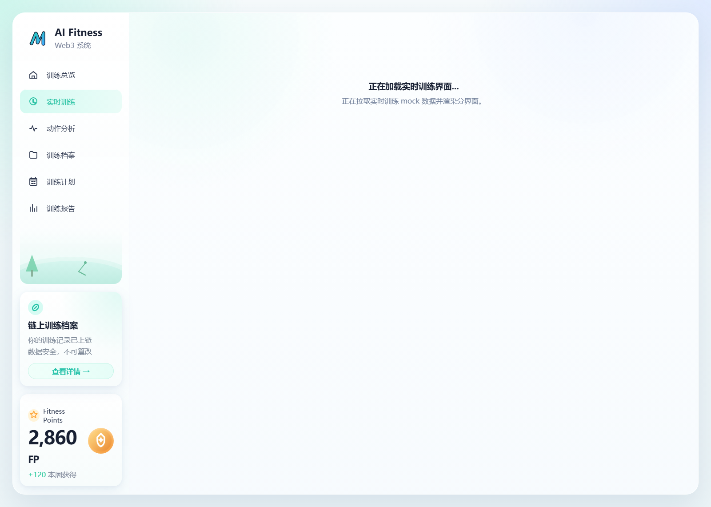

# 健身姿态识别算法

一个基于 `MediaPipe Tasks Vision` 的健身动作分析项目，支持在浏览器中完成人体关键点检测、时序特征提取、规则动作分析、事件计数和时间轴展示。

当前版本聚焦单动作分析与联调验证，目标不是做完整训练模型，而是先把这条链路跑稳：

`视频输入 -> Pose 关键点 -> 时序特征 -> 动作分析器 -> 标准事件 -> 可视化反馈`

## 项目展示

<p align="center">
  
</p>

<p align="center">
  
</p>

<p align="center">
  
</p>

> 展示区依次为：电脑端真实分析 GIF、电脑端完整界面截图、手机端采集页截图。

## 仓库内子项目

当前仓库除了主项目 `健身姿态识别算法`，还附带一个独立维护的 Vue 前端子项目：

- 子项目目录：`ai-fitness-web3-dashboard/`
- 子项目说明：高保真 AI Fitness Web3 系统前端，包含训练总览、实时训练、动作分析、训练档案、训练计划、训练报告等界面
- 子项目技术栈：`Vue 3 + Vite + Vue Router + Pinia + Axios Mock + ECharts`

进入子项目目录后可单独运行：

```bash
cd ai-fitness-web3-dashboard
npm install
npm run dev
```

子项目详细文档见：

- `ai-fitness-web3-dashboard/README.md`

子项目界面截图：

### Dashboard 界面

<p align="center">
  
</p>

### Live Training 界面

<p align="center">
  
</p>

## 项目亮点

- 支持 `深蹲 / 俯卧撑 / 平板支撑 / 哑铃弯举` 4 类动作
- 支持两种视频输入：
  - 电脑本机摄像头直接分析
  - 手机前摄通过 WebRTC 远端接入电脑端分析
- 页面实时展示：
  - 33 个关键点与骨架连线
  - FPS、推理耗时、分辨率、推理设备
  - 动作次数 / 保持时长 / 当前阶段 / 时间轴
  - 时序特征和调试指标
- 内置离线视频评测脚本，复用与页面一致的分析器逻辑

## 适用场景

- 健身动作计数与姿态规则验证
- MediaPipe Pose 二次开发
- 单动作规则法原型验证
- 手机摄像头远端接入电脑端算法分析
- 后续接桌面应用、移动 App 或训练模型前的技术验证底座

## 当前支持的动作

| 动作 | 输出 |
| --- | --- |
| 深蹲 | 次数 |
| 俯卧撑 | 次数 |
| 平板支撑 | 保持组数、保持时长 |
| 哑铃弯举 | 次数 |

## 系统形态

### 电脑端分析页

- 入口：`index.html`
- 负责：
  - 加载 MediaPipe 模型与 WASM
  - 接收本机或远端视频流
  - 提取时序特征
  - 运行动作分析器
  - 输出实时结果与时间轴

### 手机采集页

- 入口：`mobile.html`
- 负责：
  - 调用手机摄像头
  - 加入会话
  - 通过 WebRTC 推送视频流到电脑端

### 本地服务

- 文件：`server/index.js`
- 负责：
  - 创建手机接入会话
  - 提供二维码接入链接
  - 通过 WebSocket 转发 `offer / answer / ICE candidate`
  - 托管构建后的静态页面

## 功能概览

### 1. 实时姿态识别

- 调用 `Pose Landmarker`
- 输出 33 个关键点
- 绘制骨架连线
- 支持 `Lite / Full / Heavy` 三种模型切换
- 支持镜像和关键点编号显示

### 2. 动作分析

系统不是“自动识别所有动作并自由切换”的黑盒模式，而是：

1. 用户先选择一个动作
2. 系统只按该动作规则做分析
3. 页面重点展示次数、保持、频率、阶段和时间轴

这样做的好处是：

- 更利于逐动作调阈值
- 更容易稳定计数
- 离线评测与实时页面可以共用同一分析器

### 3. 时序特征展示

页面会实时展示规则法调参与诊断常用特征：

- 关键点序列
- 关节角度序列
- 关键点速度
- 重心变化
- 腕部轨迹
- 身体朝向
- 动作方向
- 器械辅助信息占位

### 4. 手机远端接入

支持用手机前摄作为输入设备：

1. 电脑端创建会话
2. 页面生成二维码和接入链接
3. 手机打开采集页
4. 手机通过 WebRTC 把视频流传回电脑端
5. 电脑端继续使用现有 MediaPipe + 分析器流程做实时分析

## 技术架构

### 特征层

主入口在 `src/main.js`，核心由 `computeTemporalFeatures(...)` 统一提取：

- 膝、髋、肘、肩角度
- 身体中心 / 髋 / 肩 / 腕位移与速度
- 角度范围与趋势斜率
- 身体朝向与主侧肢体
- 稳定性与动作方向相关指标

### 动作层

`src/engine/analyzers.js` 中为每个动作维护独立分析器，统一输出：

- 当前阶段
- 是否完成一次 `rep` 或一段 `hold`
- 当前频率
- 调试指标
- 标准事件

### 事件层

`src/engine/events.js` 将内部状态统一转为事件流：

- `rep`
- `hold_start`
- `hold_end`

时间轴和离线报告都直接消费这些事件。

### 校准层

`src/engine/calibration.js` 在动作开始前做短暂基线校准，用于根据用户站位和身体比例调整部分阈值。

### 时间轴层

`src/engine/timeline.js` 将事件流组装为页面上的时间频率轴。

### RTC 与信令层

- `src/rtc/peer-connection.js`：WebRTC Peer 封装
- `src/rtc/signaling-client.js`：WebSocket 信令客户端
- `src/rtc/session-state.js`：会话状态与 URL 组装
- `server/index.js`：HTTP / HTTPS / WebSocket 服务

## 目录结构

```text
.
├─ ai-fitness-web3-dashboard/
│  ├─ src/
│  ├─ index.html
│  ├─ package.json
│  ├─ vite.config.js
│  └─ README.md
├─ index.html
├─ mobile.html
├─ public/
│  ├─ models/
│  └─ wasm/
├─ reports/
├─ scripts/
│  └─ evaluate-videos.mjs
├─ server/
│  └─ index.js
├─ src/
│  ├─ main.js
│  ├─ mobile.js
│  ├─ style.css
│  ├─ engine/
│  │  ├─ analyzers.js
│  │  ├─ calibration.js
│  │  ├─ events.js
│  │  └─ timeline.js
│  └─ rtc/
│     ├─ peer-connection.js
│     ├─ session-state.js
│     └─ signaling-client.js
├─ vite.config.js
└─ package.json
```

## 环境要求

- Node.js 18+
- Chrome / Edge 等现代浏览器
- 手机远端接入时，手机和电脑建议在同一局域网

## 安装

```bash
npm install
```

## 启动方式

### 开发模式

```bash
npm run dev
```

默认会同时启动：

- 前端开发服务：`http://127.0.0.1:5173`
- 信令服务：`http://127.0.0.1:8787`
- HTTPS 服务：`https://127.0.0.1:8788`

### 只启动前端

```bash
npm run dev:client
```

### 只启动信令服务

```bash
npm run dev:signal
```

### 构建

```bash
npm run build
```

会构建两个入口：

- `index.html`
- `mobile.html`

### 构建后启动完整服务

```bash
npm run build
npm run serve
```

`serve` 会启动本地服务并托管 `dist/` 页面。

## 使用方式

### 方案一：本机摄像头分析

1. 打开电脑端页面
2. 选择动作
3. 保持“本机前置摄像头”
4. 点击“启动摄像头”
5. 观察关键点、动作次数、阶段、频率和时间轴

### 方案二：手机前摄远端分析

1. 启动 `npm run dev` 或 `npm run serve`
2. 电脑端把视频源切到“手机前摄远端接入”
3. 创建手机接入会话
4. 手机扫码进入采集页
5. 手机接受 HTTPS 证书提示和摄像头权限
6. 手机上点击“启动前摄推流”
7. 电脑端接收远端画面并继续分析

## 离线视频评测

项目内置离线评测脚本：

- 脚本：`scripts/evaluate-videos.mjs`
- 报告：
  - `reports/video-evaluation-report.md`
  - `reports/video-evaluation-report.json`

特点：

- 复用页面同一套分析器和事件层
- 按固定 FPS 对本地视频采样回放
- 输出关键点覆盖率、首次响应、系统计数和摘要报告

## 示例素材

仓库当前包含 4 个示例视频：

- `深蹲.mp4`
- `俯卧撑.mp4`
- `平板支撑.mp4`
- `哑铃弯举.mp4`

可用于本地测试和离线评测。

## 已知限制

### 1. 当前仍是规则法

系统尚未引入训练好的动作分类模型或时序网络，因此对以下因素比较敏感：

- 视角偏差
- 遮挡
- 光照变化
- 动作幅度不足
- 节奏过快或过慢

### 2. 动作稳定性存在差异

目前深蹲和弯举相对更稳定；俯卧撑已经持续优化，但在节奏变化较大、顶点伸展不足或后程疲劳时仍可能出现漏计。

### 3. 手机远端模式依赖浏览器环境

远端模式会受到以下因素影响：

- 手机浏览器对 WebRTC 的兼容性
- 是否接受 HTTPS 证书
- 局域网质量与抖动
- 移动端缓存导致的旧页面问题

### 4. 当前更适合作为原型与验证底座

如果要产品化，后续更合适的方向通常是：

- 电脑端封装为 Windows 安装包
- 手机端改为原生 App 或跨平台 App
- 进一步引入模型化动作识别或姿态评分

## 后续规划建议

1. 补齐离线视频的真值次数，建立可量化评测基线
2. 继续收敛俯卧撑计数规则，降低漏计
3. 抽离阈值配置与动作参数面板
4. 完善远端接入链路的稳定性和错误提示
5. 评估原生 iOS App / Windows 桌面安装包路线
6. 在规则法稳定后考虑引入动作分类模型

## 许可证

当前仓库未附带单独许可证文件。  
如果准备对外分发或商用，建议补充明确的 `LICENSE`。
